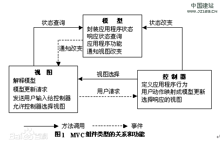

# MFramework

## 一、MVC框架

### 1 .MVC架构

经典MVC模式中，M是指业务模型，V是指用户界面，C则是控制器，使用MVC的目的是将M和V的实现代码分离，从而使同一个程序可以使用不同的表现形式。其中，View的定义比较清晰，就是用户界面。

MVC详解可以参考知乎回答[如何理解MVC](https://wjrsbu.smartapps.cn/zhihu/article?_swebfr=1&id=35680070&isShared=1&hostname=baiduboxapp)，在此便不再过多赘述。下面详解一下本框架的实现思路与使用案例。

###  2.框架实现思路

####  (1).定义MVC框架管理器——MVCSystem。

该类为静态类，主要存储MVC中的数据并完成事件的转发。

在其中存储三个字典：

1. View名称与BaseView对象字典。
2. Model名称与BaseModel对象字典。
3. 事件名称(EventName)与BaseController类型的Type对象。

并且提供响应的注册与删除方法。同时提供查询View与Model的方法（根据名字和类型查找），方便在Controller中查询到View与Model，并调用相应方法。

最后，在MVCSystem中，最重要的方法是SendEvent方法，该方法接收两个参数(一个参数和一个不定参数列表)——发送事件名字与发送数据。MVCSystem会在Controller与View中查找注册了该事件类，并触发他们中的HandleEvent方法。

在阅读知乎的文章后，我们知道Controller其实是View的一种。就好比在J2EE框架中，JSP作为前端显示页面，其中也可以包含Servlet中的Java代码，而Servlet就是JSP的一种只用来处理逻辑的形式。所以在View层中我们也可以让其直接接收事件并相应，无需经过Controller转发（因为View本身也是一种Controller），从而减少Controller数量。

####  (2).定义View层基类——BaseView。

该类为抽象类，并且继承自MonoBehaviour，是游戏展示给玩家的元素的控制类（UI元素以及非UI元素）。

1. 在其中存储一个列表(_attationEvents)，用来保存View响应事件的事件名称(EventName)。

2. 提供一个抽象属性Name，用作View的唯一标识。

3. 提供注册响应事件虚方法(RegisterAttationEvents)，子类通过重写该方法注册具体的响应事件。(由于存储响应事件的列表是私有的，子类无法直接访问，可以通过父类提供的RegisterAttationEvent方法添加)

4. 提供响应事件的抽象方法(HandleEvent)，方法第一个参数为事件名称(EventName)，可以通过它来判断当前响应的是什么事件。

5. 提供获得模型的方法。

6. 提供发送事件方法(调用MVCSystem中的发送事件的方法，尽量隐藏MVCSystem，避免外界调用)。

#### (3).定义Model层基类——BaseModel。

该类为抽象类，主要用存储数据并处理数据逻辑。

1. 提供一个抽象属性Name，用作View的唯一标识。
2. 提供发送事件方法(调用MVCSystem中的发送事件的方法，尽量隐藏MVCSystem，避免外界调用)。

 #### (4).定义Controller层基类——BaseController。

该类为抽象类，主要用来响应并处理请求。

1. 提供注册、查询、删除Model和View的方法(调用MVCSystem中的对应的方法，尽量隐藏MVCSystem，避免外界调用)。
2. 提供抽象方法(Execute)，用以响应并处理请求。(由于事件名称(EventName)与Controller是一一对应，所以参数中不包含事件名称)。

### 3.案例

- 利用该框架复刻了经典游戏[《俄罗斯方块》](https://github.com/PositiveMumu/Tetris)。可以通过该案例来具体学习本框架在项目中的具体应用。

